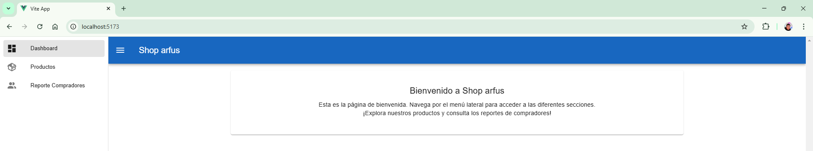
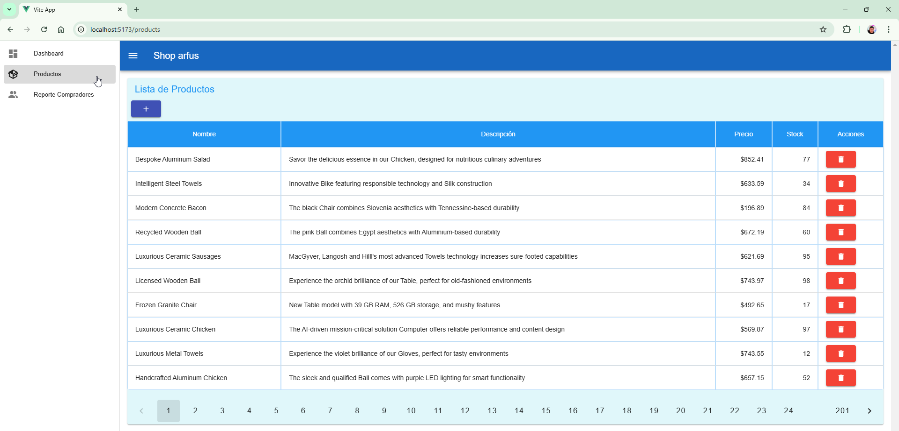
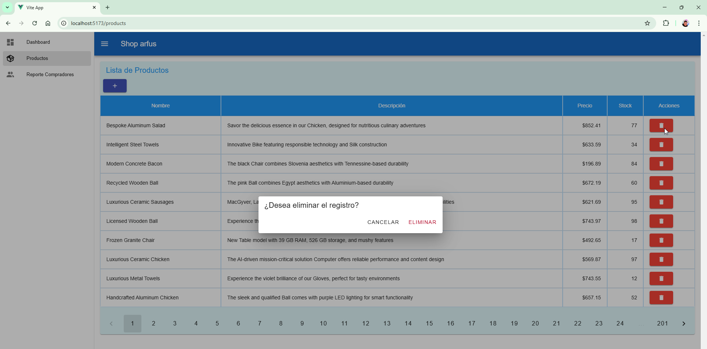
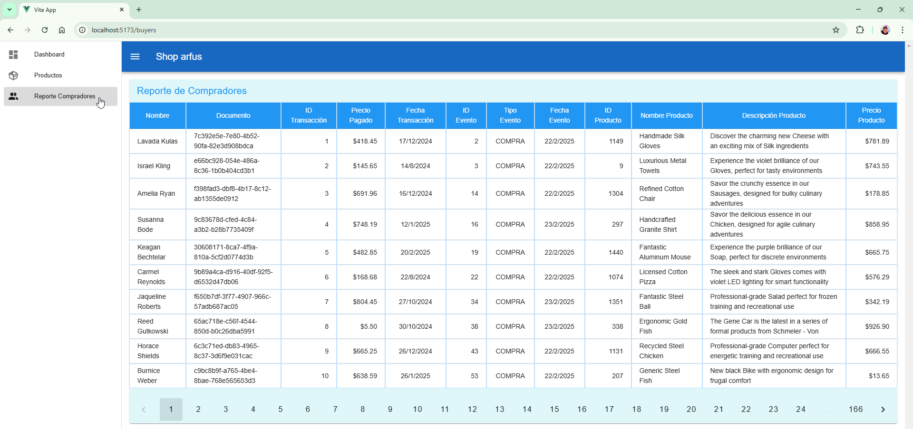

# Tienda Arfus

## 📌 Descripción
Este proyecto implementa un sistema de gestión de productos y compras utilizando **Node.js**, **Express**, **Sequelize**, **MySQL**, y una interfaz de usuario con **Vue.js**.

## 🛠️ Tecnologías Utilizadas
- **Backend:** Node.js, Express, Sequelize (ORM)
- **Base de Datos:** MySQL
- **Frontend:** Vue.js, Axios
- **Pruebas:** Jest, Supertest, Vue Test Utils
- **Seeders:** Faker

## 📂 Estructura del Proyecto
```
├── backend
│   ├── models (Modelos Sequelize)
│   ├── routes (Rutas Express)
│   ├── controllers (Controladores de lógica de negocio)
│   ├── services (Servicios adicionales)
│   ├── config (Configuración de base de datos y entorno)
│   ├── server.js (Archivo principal de Express)
│   ├── tests (Pruebas unitarias con Jest y de integración con Supertest)
│   ├── package.json (Dependencias y scripts de Node.js)
│   └── .env (Configuraciones de entorno)
│
├── frontend
│   ├── src
│   │   ├── components (Componentes Vue)
│   │   ├── views (Vistas principales)
│   │   ├── router (Rutas Vue Router)
│   │   ├── App.vue (Componente raíz)
│   │   ├── main.js (Punto de entrada de Vue)
│   │   └── services (Patrón de llamadas con axios)
│   └── package.json (Dependencias y scripts de Vue.js)
```

## 🚀 Instalación y Configuración

### 🔹 1. Clonar el Repositorio
```sh
git clone https://github.com/ruloseptimo/tienda-arfus.git
cd tienda-arfus/backend
```

### 🔹 2. Configurar Backend
```sh
npm install
cp .env.example .env  # Configurar variables de entorno
```
**Migrar la Base de Datos:**
```sh
npx sequelize-cli db:migrate
```
**Llenar con Datos Dummy con faker:**
```sh
node scripts/fillDatabase.js
```
**Ejecutar Servidor Backend:**
```sh
npm start
```

### 🔹 3. Configurar Frontend
```sh
cd ../frontend
npm install
npm run dev
```

## 📡 API REST - Endpoints
| Método | Endpoint | Descripción |
|--------|-----------------|-------------|
| GET | `/api/products` | Obtener todos los productos |
| POST | `/api/products` | Crear un producto |
| DELETE | `/api/products/:id` | Eliminar un producto |
| POST | `/api/events` | Registrar un evento de comprador |
| GET | `/api/queries/filtered-products` | Obtener la lista de productos con un precio mayor a 50 y una cantidad en stock menor a 20 |
| GET | `/api/queries/transaction-report` | Obtener un informe con los siguientes datos: informe de transacciones con: Nombre y apellido de usuario, Id del usuario, documento del usuario, número de transacción, valor de transacción, fecha de la transacción, ID del evento relacionado a la compra |

## 🧪 Ejecución de Pruebas
**Pruebas Backend:**
```sh
cd backend
npm test
```
## Imagenes
**Página principal:**


**Lista de Productos:**


**Crear un Producto:**


**Eliminar un Producto:**


**Reporte de Compradores:**


## 📌 Contribución
1. Haz un **fork** del repositorio.
2. Crea una nueva rama (`git checkout -b feature-nueva`).
3. Realiza los cambios y haz commit (`git commit -m 'Agrega nueva característica'`).
4. Sube los cambios (`git push origin feature-nueva`).
5. Abre un **Pull Request**.

## 📄 Licencia
Este proyecto está bajo la **MIT License**.

---
**¡Gracias!**

